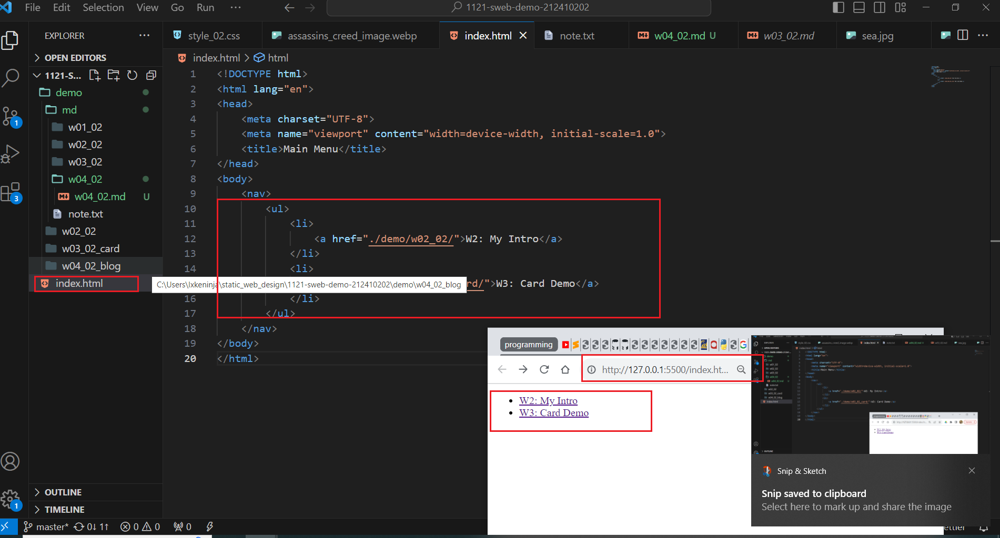
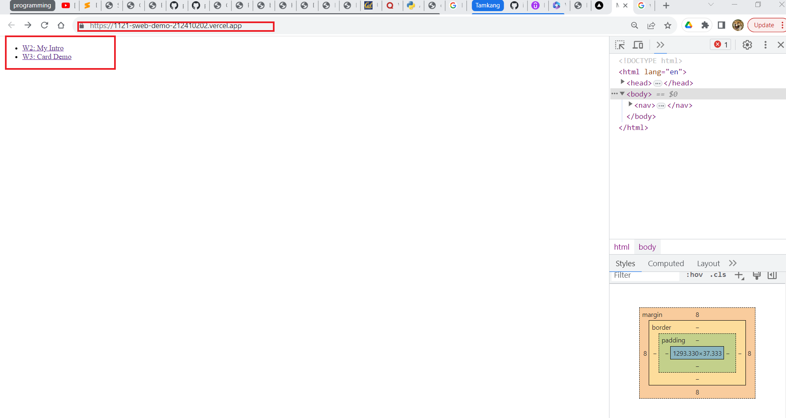
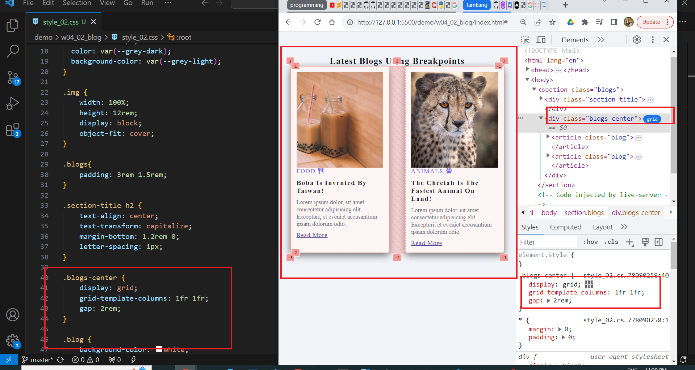

[my Github repo url](https://github.com/ixkeninja/1121-sweb-demo-212410202)

### W04-P1: add index.html in home directory

### W04-P2: Use css grid for two blogs locally

### W04-P3: show W04-P2 in Vercel

### W04-p4:

'''
git log --pretty=format:"%h%x09%an%x09%ad%x09%s" --after="2023-10-08"
'''