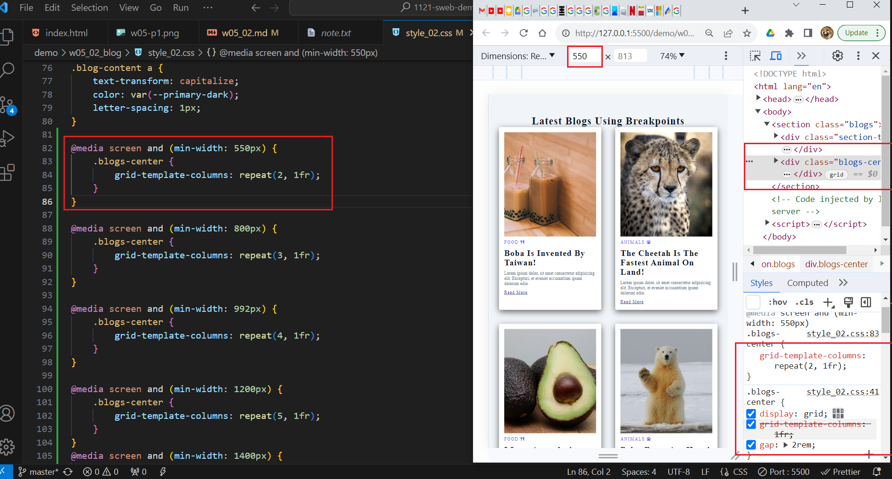
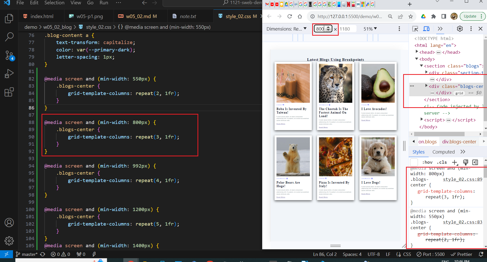
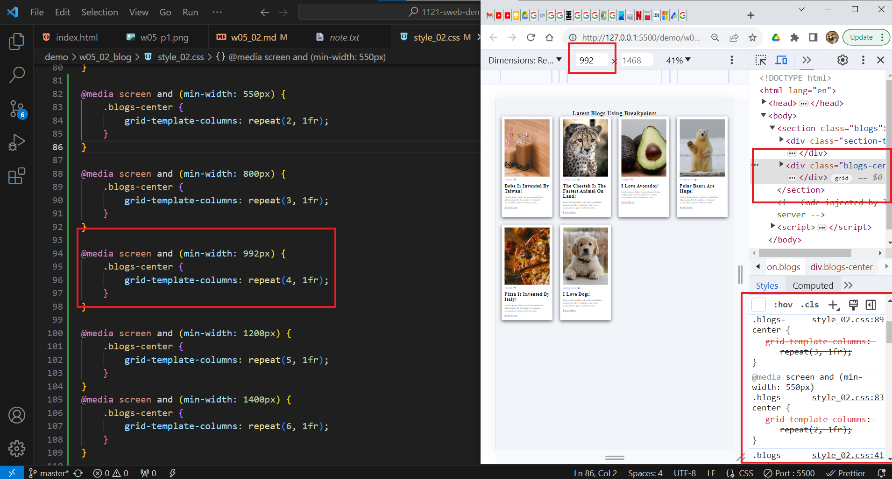
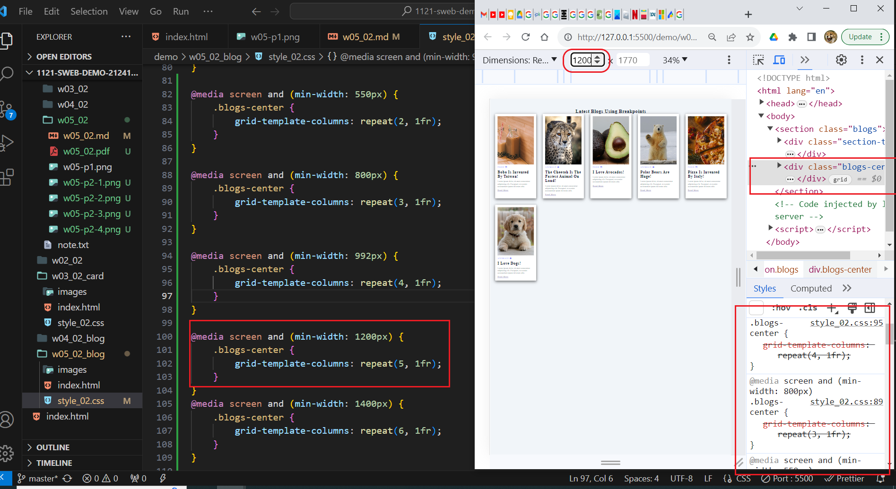
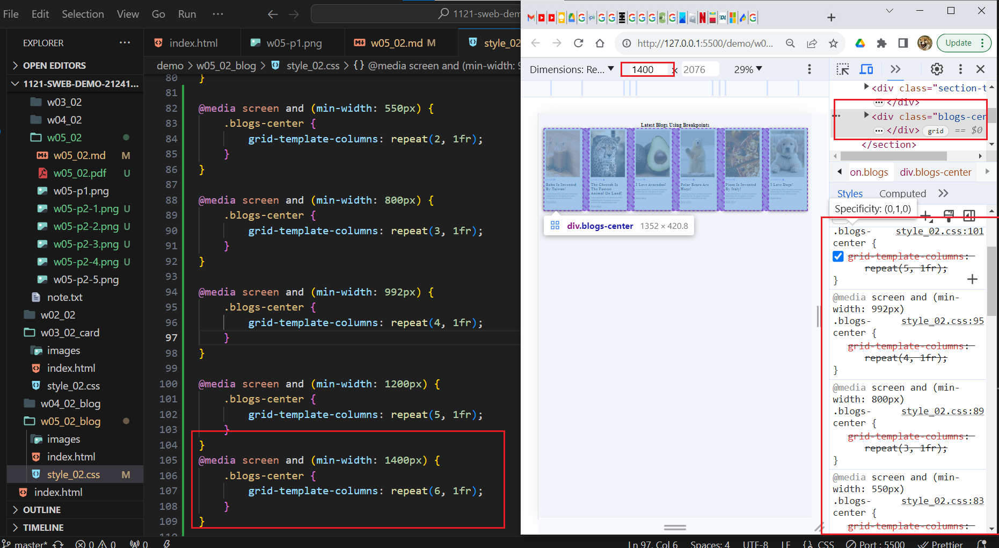

git config --global user.email "212410202@o365.tku.edu.tw"
git config --global user.name "ixkeninja"

git log --pretty=format:"%h%x09%an%x09%ad%x09%s" --after="2023-10-11"

17ba454 ixkeninja       Tue Oct 17 15:22:14 2023 +0800  show 6 photos in css grid

// weekly template
[my Github repo url](https://github.com/ixkeninja/1121-sweb-demo-212410202)

### W05-P1: show 6 photos in css grid

### W05-P2: use RWD breakpoints to show photos

### W05-P3: my introduction using style_02.css

### W05-p4: W2 git logs

