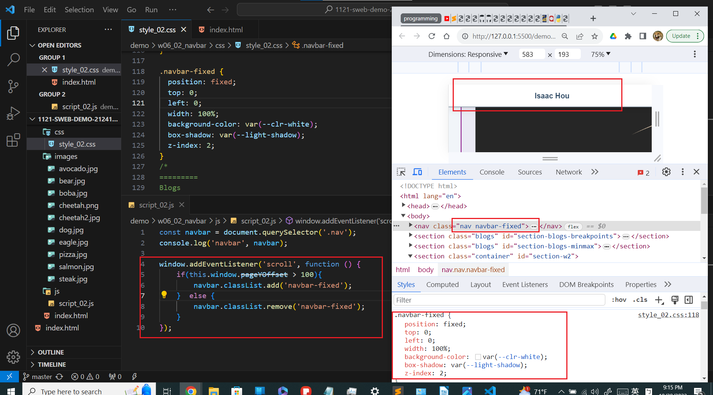

git config --global user.email "212410202@o365.tku.edu.tw"
git config --global user.name "ixkeninja"

git log --pretty=format:"%h%x09%an%x09%ad%x09%s" --after="2023-10-11"

// weekly template
[my Github repo url](https://github.com/ixkeninja/1121-sweb-demo-212410202)

### W06-P1: Navbar setup with two links to #section-blogs-breakpoints and #section-blogs-minmax

ee14920 ixkeninja       Sun Oct 22 21:18:20 2023 +0800  Navbar setup with two links to #section-blogs-breakpoints and #section-blogs-minmax

### W06-P2: use js to control when to add or remove .navbar-fixed
[Vercel URL](https://vercel.com/ixkeninjas-projects/1121-sweb-demo-212410202)

### W05-P3: RWD using minmax method, show 9 blogs
[Vercel URL](https://vercel.com/ixkeninjas-projects/1121-sweb-demo-212410202)

5d5dede ixkeninja       Thu Oct 19 02:01:21 2023 +0800  RWD using minmax method, show 9 blogs

### W05-p4: W5 git logs

