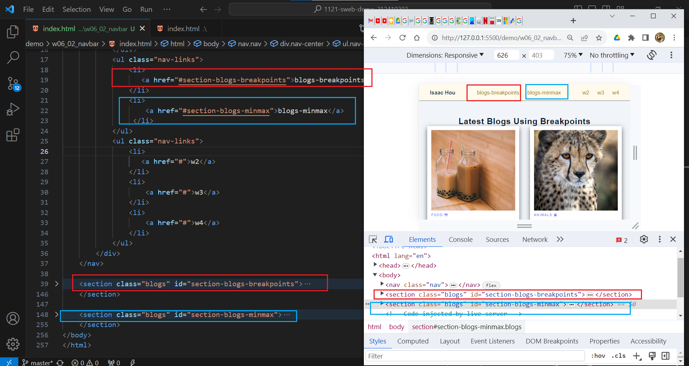
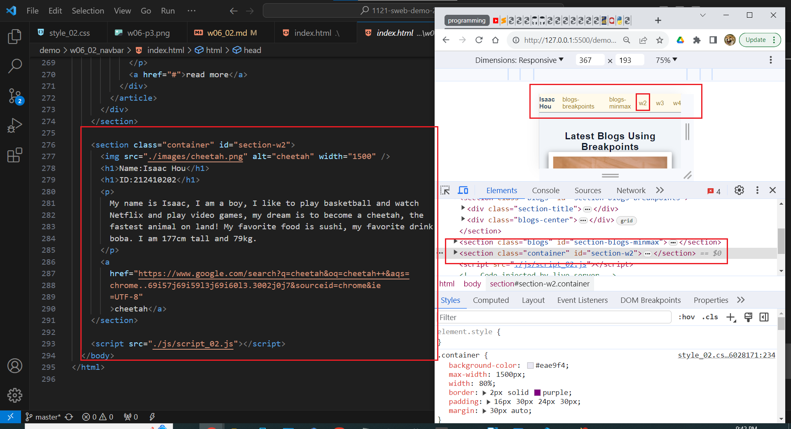
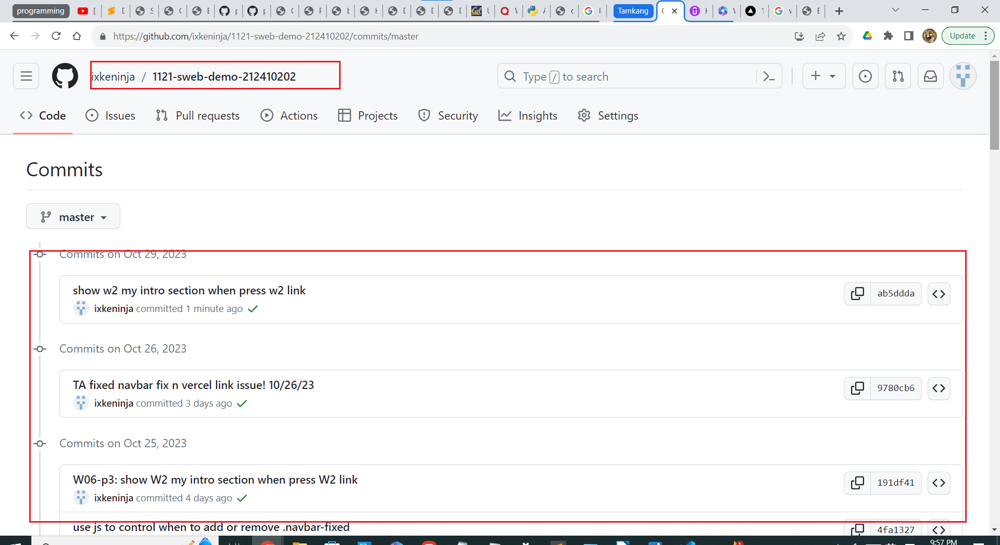

git config --global user.email "212410202@o365.tku.edu.tw"
git config --global user.name "ixkeninja"

git log --pretty=format:"%h%x09%an%x09%ad%x09%s" --after="2023-10-11"

// weekly template
[my Github repo url](https://github.com/ixkeninja/1121-sweb-demo-212410202)

### W06-P1: Navbar setup with two links to #section-blogs-breakpoints and #section-blogs-minmax

ee14920 ixkeninja       Sun Oct 22 21:18:20 2023 +0800  Navbar setup with two links to #section-blogs-breakpoints and #section-blogs-minmax

4fa1327 ixkeninja       Wed Oct 25 14:49:12 2023 +0800  use js to control when to add or remove .navbar-fixed

### W06-P2: use js to control when to add or remove .navbar-fixed
[Vercel URL](https://vercel.com/ixkeninjas-projects/1121-sweb-demo-212410202)

### W06-P3: show w2 my intro section when press w2 link
[Vercel URL](https://vercel.com/ixkeninjas-projects/1121-sweb-demo-212410202)

### W06-p4: W6 git logs

ab5ddda ixkeninja       Sun Oct 29 21:56:38 2023 +0800  show w2 my intro section when press w2 link
9780cb6 ixkeninja       Thu Oct 26 19:43:07 2023 +0800  TA fixed navbar fix n vercel link issue! 10/26/23   
191df41 ixkeninja       Wed Oct 25 23:02:01 2023 +0800  W06-p3: show W2 my intro section when press W2 link 
4fa1327 ixkeninja       Wed Oct 25 14:49:12 2023 +0800  use js to control when to add or remove .navbar-fixed