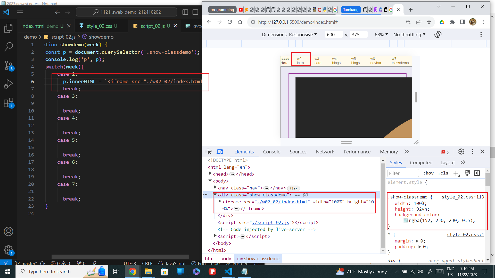
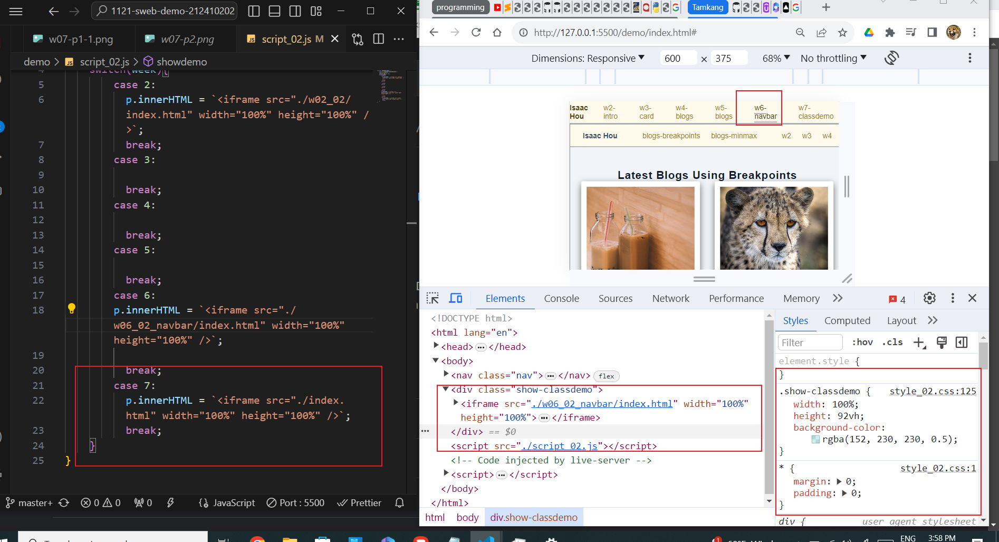
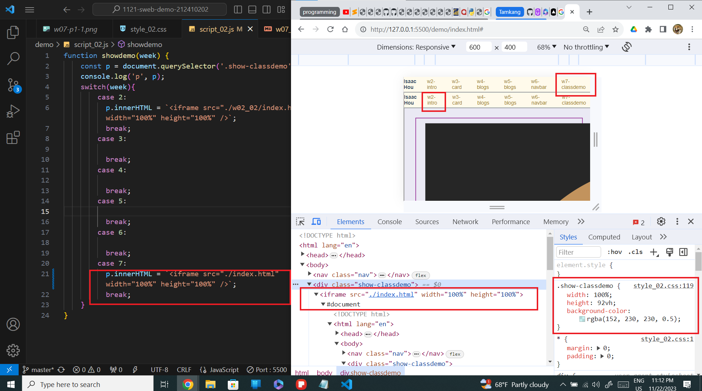

git config --global user.email "212410202@o365.tku.edu.tw"
git config --global user.name "ixkeninja"

git log --pretty=format:"%h%x09%an%x09%ad%x09%s" --after="2023-11-11"

// weekly template
[my Github repo url](https://github.com/ixkeninja/1121-sweb-demo-212410202)
[Vercel URL](https://vercel.com/ixkeninjas-projects/1121-sweb-demo-212410202)

### W07-P1: show classdemo of week 2 and week 7

### W07-P2: create nav links of class demos

### W07-P3: show classdemo w1, w6, w7

### W07-p4: W7 git logs

