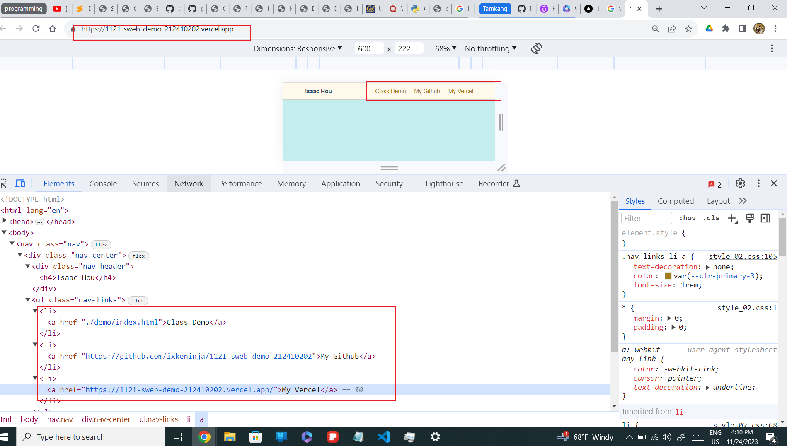
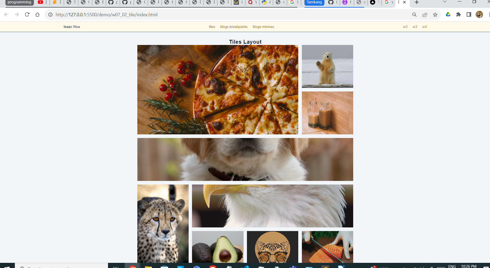

git config --global user.email "212410202@o365.tku.edu.tw"
git config --global user.name "ixkeninja"

git log --pretty=format:"%h%x09%an%x09%ad%x09%s" --after="2023-11-11"

// weekly template
[my Github repo url](https://github.com/ixkeninja/1121-sweb-demo-212410202)
[Vercel URL](https://vercel.com/ixkeninjas-projects/1121-sweb-demo-212410202)

### W07-P1: show classdemo of week 2 and week 7
## week 2

### week 7 Q1 part 2 (week 6) ask ta for help!-done 11/23/23 9:36 pm

677c9bb ixkeninja       Wed Nov 22 21:39:33 2023 +0800  Merge branch 'master' of https://github.com/ixkeninja/1121-sweb-demo-212410202
9fb8f3b ixkeninja       Wed Nov 22 21:12:23 2023 +0800  W07-P1: show classdemo of week 2, week 7 do later

### W07-P2: show classdemo of week 7

2c79eb5 ixkeninja       Wed Nov 22 23:27:10 2023 +0800  W07-P2: show classdemo of week 7

### W07-P3: add index.html as home page with links of class demo, my Github and my Vercel

e11d9c9 ixkeninja       Thu Nov 23 20:17:47 2023 +0800  add index.html as home page with links of class demo, my Github and my Vercel

### W07-p4: W7 git logs

