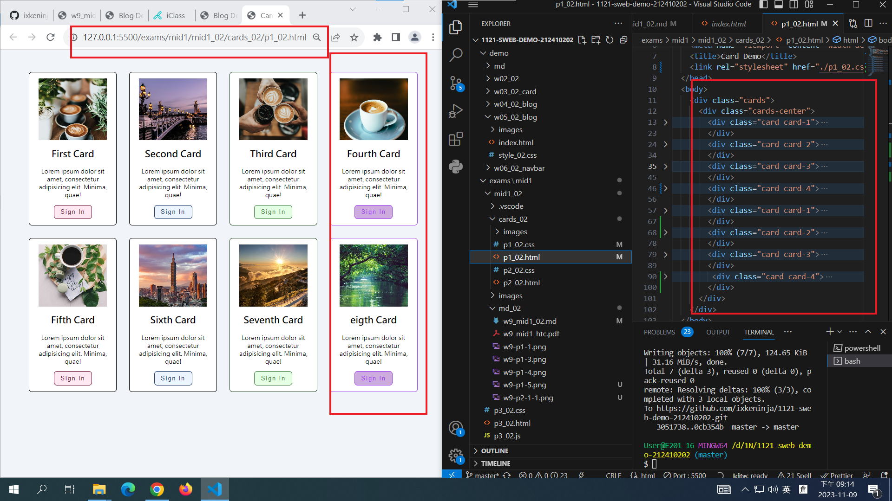
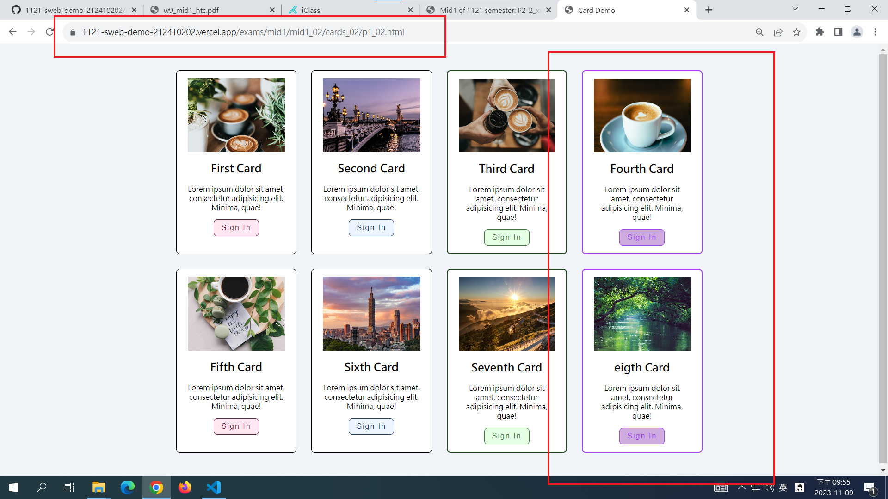

# (12.5%) 靜態網頁 期中考-1 -- 開放網路

##### 2023-11-09, at E201

#### Note:

1. 請不要發揮同學愛，作弊雙方除了本次考試 0 分外，平常分數另扣 20 分。
2. iClass 上請繳交 w9_mid1_xx.md, w19_mid1_xx.pdf，mid1_xx.zip (如有需要，請移除圖片)，所有程式請 git push 到 Github，助教可以檢查。
3. 老師將題目提供在 w9_mid1_xx.md 檔案上，要實作的部分放在 w9_mid1_htc.pdf 上，請依照老師實作的圖片在你自己的 Github repo, Vercel 上實作
4. 每一張圖片要有左側機房背景，圖片標註要跟老師所標註的類似。違者會依情節扣分。
5. 請自評分數，將每一題的 ? 填入分數，沒有填者，不會批改，以 0 分計算。

Your (Name, ID): (name, id)

##### P1 (30%): 基本題

- P1-1 (6%): ? 分
- P1-2 (6%): ? 分
- P1-3 (6%): ? 分
- P1-4 (6%): ? 分
- P1-5 (6%): ? 分

##### P2 (40%): 課堂實作延伸題 (card)

- P2-1 (20%): ? 分
- P2-2 (20%): ? 分

##### P3 (30%): 課堂實作延伸題 (選單)

- P3-1 (15%): ? 分
- P3-2 (15%): ? 分
- 總分: ? 分

---

## (30%) P1: 基本題

#### (6%) P1-1: Show Your Github Repo

[My Github Repo URL]()


#### (6%) P1-2: Show Your Github commits of week 7


#### (6%) P1-3: Show Your Vercel page for class demo of week 5

[My Vercel URL of demo W5]()


#### (6%) P1-4: 將本次考題 mid1_xx 目錄下所有內容放入 exams/mid1 中，並將所有出現 xx 的目錄或檔案改成你的學號後兩碼，git push 到 Github 顯示如下圖


#### (6%) P1-5: P1 git push 到 Github，並顯示 git log


```
git log --pretty=format:"%h%x09%an%x09%ad%x09%s" --after="2023-11-08"


```

---

## (40%) P2: class demo 延伸題 -- card

Note: 本大題是根據 quiz1 而來，原先老師放在 p1_xx.html 內的 class 不要更動，可新增其他 html, css 以回答本大題。

#### (20%) P2-1: 請根據老師所給的 p1_xx.html，原先是 6 張卡片，如下圖，


#### 請修改 p1_xx.html, 並設定 css grid，每一列顯示 4 張 cards，要顯示 8 張卡片 (photo-1.jpg ~ photo-8.jpg)，加入一個新的色系， rgb(161, 68, 238);，讓 8 張圖片以紅藍綠紫，紅藍綠紫方式呈現。新的色系背景(background-color) 及邊界(border)請用 rgba(161, 68, 238, ?)的方式來表示

##### => 本機端顯示



##### => 顯示所有新色系會用到的 css，包含變數設定及相關 card-4, btn-4 等 class 之 css，請以多視窗顯示，截一張圖繳交


##### => Git push 到 Vercel，能顯示本題結果



#### (20%) P2-2: 請根據老師已給的 p2_xx.html, p2_xx.css 實作畫面如下，p2_xx.html 裡面所設定的 class 名稱請不要修改。

##### => 本機端顯示


##### => 顯示 p2_xx.css 本題用到的部分，只要一張截圖即可，同一個 css 可以在多個試窗中顯示


##### => Vercel 上顯示


---

## (30%) P3: class demo 延伸題 -- nav

#### (15%) P3-1: 請根據老師所給的 p3_xx.html，在 html 加入你的學號姓名，並加入 css，顯示選單如下圖，p3_xx.html 老師已給的部分，除非有必要，不能隨意修改(成跟上課 demo 的一樣)。

##### => P2-1_xx 題，瀏覽器結果


##### => P2-2_xx 題，瀏覽器結果


##### => p3_xx.js 截圖


##### => P3_xx.css 截圖 (放入兩個視窗，一張圖顯示)


#### (15%) P3-2: 本題主要實作 landing page，要將 P2-1, P2-2 結果顯示在同一個網頁上。點選 P2-1 時，跳至 P2-1 題答案，點選 P2-2 時，跳至 P2-2 答案。

請先將 p3_xx.css 含選單部分 css 複製一份到 p4_xx.css。用老師已給的 p4_xx.html，開始作答。p4_xx.html 老師已經寫好的框架及 class 名稱，除非必要請不要改變。

要使用 navbar-fixed，讓選單固定在畫面上。點選 P2-2_x 要看到此固定選單，但當點選 P2-1_xx 時，navbar-fixed 選單固定會不見。

##### => 點選 P2-1_xx

如果 css 跑掉，請自行修改成類似下圖


##### => 點選 P2-2_xx

如果 css 跑掉，請自行修改成類似下圖


##### => 顯示本題對應的 html (用多個視窗呈現，截一張圖)


##### => 顯示本題對應的 css (用多個視窗呈現，截一張圖)


##### => 顯示本題對應的 js (用多個視窗呈現，截一張圖)


